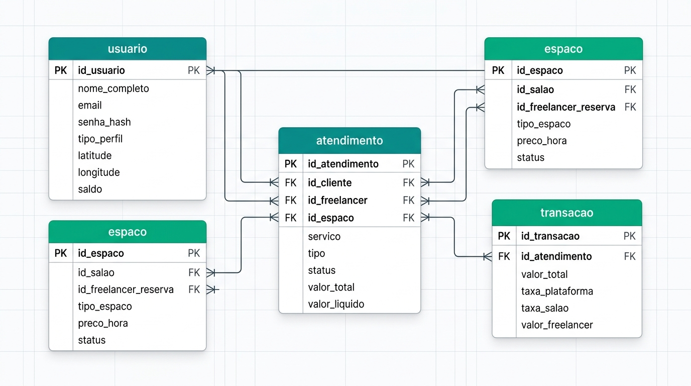
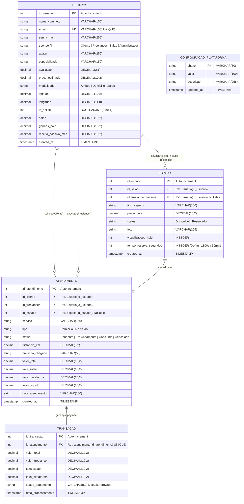

# AGhataCris – Documentação Técnica Oficial
## Sprint 2: Implementação do Back-End Inicial
### Conexão com Banco de Dados, Criação das Primeiras Entidades e Endpoints de Cadastro/Listagem

---

## 1. RESUMO EXECUTIVO DAS ENTREGAS REALIZADAS

A **Sprint 2** contemplou a construção da infraestrutura completa de **Back-End** da plataforma **AGhataCris**, estabelecendo a camada de persistência em banco de dados relacional com integridade referencial, desenvolvimento dos modelos de negócio em camadas, segurança com criptografia de credenciais, motor de cálculo espacial no servidor e uma API RESTful completa integrada ao Front-End PWA.

### Principais Marcos Concluídos:
* **Conexão e Modelagem de Banco de Dados Relacional**: Implementação das entidades `usuario`, `espaco`, `atendimento`, `transacao` e `configuracao_plataforma` com integridade de Chaves Primárias (`PK`), Chaves Estrangeiras (`FK`) e índices de busca.
* **Scripts SQL Padronizados**: Criação dos scripts [`database/schema.sql`](file:///c:/Users/jefer/Documents/aghatacris-web/database/schema.sql) (DDL) e [`database/seed.sql`](file:///c:/Users/jefer/Documents/aghatacris-web/database/seed.sql) (DML com dados de demonstração).
* **Segurança e Criptografia (RNF03)**: Armazenamento seguro de senhas com PBKDF2/SHA-256 e salts criptográficos aleatórios de 16 bytes.
* **Cálculo Espacial no Servidor (RF03, RNF01)**: Implementação da **Fórmula de Haversine** para filtragem estrita de profissionais no raio de até 15 km da cliente e ordenação por menor distância.
* **Motor de Divisão Financeira / Split Payment (RF10)**: Rateio automatizado das transações com dedução da comissão da plataforma (10%), repasse do aluguel da cadeira ao salão parceiro e crédito líquido na carteira da freelancer.
* **Conjunto Completo de Endpoints RESTful**: Rotas de autenticação, perfil, atualização de GPS, busca de profissionais, anúncio e reserva de espaços ociosos (limite de 30min), chamados sob demanda e métricas administrativas.
* **Integração Front-End**: Criação do módulo [`js/api.js`](file:///c:/Users/jefer/Documents/aghatacris-web/js/api.js) e sincronização reativa com [`js/state.js`](file:///c:/Users/jefer/Documents/aghatacris-web/js/state.js).
* **Validação Automatizada**: Execução de 29 testes de backend e 32 testes de rotas/endpoints com 100% de sucesso.

---

## 2. MODELAGEM CONCEITUAL E DICIONÁRIO DE DADOS (MODELO LÓGICO)

### 2.1 Diagrama Entidade-Relacionamento (DER)





### 2.2 Dicionário de Dados das Tabelas

#### Tabela 1: `usuario`
Responsável por centralizar o armazenamento de todos os perfis da plataforma (Cliente, Freelancer, Salão Parceiro e Administrador).
* `id_usuario`: INT (PK / Auto-incremento) - Identificador exclusivo do ator.
* `nome_completo`: VARCHAR(150) (NOT NULL) - Nome pessoal ou razão social do estabelecimento.
* `email`: VARCHAR(150) (NOT NULL, UNIQUE) - E-mail de autenticação e comunicação.
* `senha_hash`: VARCHAR(255) (NOT NULL) - Hash criptográfico com Salt aleatório (`RNF03`).
* `tipo_perfil`: VARCHAR(50) (NOT NULL) - Segregação de papel: `'Cliente'`, `'Freelancer'`, `'Salao'`, `'Administrador'`.
* `avatar`: VARCHAR(255) - URL da fotografia do perfil.
* `especialidade`: VARCHAR(150) (NULL) - Habilidade principal da profissional (ex: "Design de Sobrancelhas", "Hair Stylist").
* `avaliacao`: DECIMAL(2, 1) (DEFAULT 5.0) - Nota média calculada por avaliações.
* `preco_estimado`: DECIMAL(10, 2) - Valor de referência para pronto atendimento.
* `modalidade`: VARCHAR(50) (DEFAULT 'Ambos') - Opções: `'Ambos'`, `'Domicilio'`, `'Salao'`.
* `latitude`: DECIMAL(10, 8) (NOT NULL) - Coordenada geográfica Y para GPS e radar (`RF02`).
* `longitude`: DECIMAL(11, 8) (NOT NULL) - Coordenada geográfica X para GPS e radar (`RF02`).
* `is_online`: INT (DEFAULT 1) - Status de disponibilidade em tempo real (1 = Disponível, 0 = Offline).
* `saldo`: DECIMAL(10, 2) (DEFAULT 0.00) - Saldo financeiro acumulado para saque na carteira.
* `ganhos_hoje`: DECIMAL(10, 2) (DEFAULT 0.00) - Faturamento diário da freelancer.
* `receita_passiva_mes`: DECIMAL(10, 2) (DEFAULT 0.00) - Total auferido pelo salão parceiro na locação de cadeiras.
* `created_at`: TIMESTAMP (DEFAULT CURRENT_TIMESTAMP) - Data de criação do registro.

#### Tabela 2: `espaco`
Responsável por gerenciar a infraestrutura física (cadeiras, macas, bancadas) anunciada pelos salões parceiros.
* `id_espaco`: INT (PK / Auto-incremento) - Identificador exclusivo do espaço.
* `id_salao`: INT (FK -> `usuario.id_usuario`, NOT NULL) - Referência ao salão proprietário.
* `id_freelancer_reserva`: INT (FK -> `usuario.id_usuario`, NULL) - Referência à freelancer que efetuou a reserva.
* `tipo_espaco`: VARCHAR(100) (NOT NULL) - Descrição da infraestrutura (ex: "Cadeira de Corte", "Maca de Estética").
* `preco_hora`: DECIMAL(10, 2) (NOT NULL) - Preço em reais cobrado por hora de uso (`RF07`).
* `status`: VARCHAR(50) (DEFAULT 'Disponível') - Estado do anúncio (`'Disponível'`, `'Reservado'`).
* `foto`: VARCHAR(255) - Fotografia ilustrativa do ambiente.
* `visualizacoes_hoje`: INT (DEFAULT 0) - Métrica de engajamento do anúncio.
* `tempo_reserva_segundos`: INT (DEFAULT 1800) - Tolerância de 30 minutos para comparecimento (`RF09`).
* `created_at`: TIMESTAMP - Data do anúncio.

#### Tabela 3: `atendimento`
Responsável por orquestrar o chamado de pronto atendimento estético sob demanda.
* `id_atendimento`: INT (PK / Auto-incremento) - Identificador único do chamado.
* `id_cliente`: INT (FK -> `usuario.id_usuario`, NOT NULL) - Cliente solicitante (`RF05`).
* `id_freelancer`: INT (FK -> `usuario.id_usuario`, NOT NULL) - Profissional designada para o serviço.
* `id_espaco`: INT (FK -> `espaco.id_espaco`, NULL) - Espaço físico reservado, caso o serviço ocorra em salão parceiro.
* `servico`: VARCHAR(150) (NOT NULL) - Nome do procedimento solicitado.
* `tipo`: VARCHAR(50) (NOT NULL) - `'Domicílio'` ou `'No Salão'` (`RF04`).
* `status`: VARCHAR(50) (DEFAULT 'Pendente') - Estados: `'Pendente'`, `'Em Andamento'`, `'Concluído'`, `'Cancelado'`, `'Recusado'`.
* `distancia_km`: DECIMAL(5, 2) - Distância calculada pelo algoritmo de Haversine.
* `previsao_chegada`: VARCHAR(50) - Horário estimado de chegada da profissional.
* `valor_total`: DECIMAL(10, 2) (NOT NULL) - Valor bruto pago pela cliente.
* `taxa_salao`: DECIMAL(10, 2) (DEFAULT 0.00) - Valor repassado ao salão parceiro.
* `taxa_plataforma`: DECIMAL(10, 2) - Taxa de intermediação do AGhataCris (10%).
* `valor_liquido`: DECIMAL(10, 2) (NOT NULL) - Valor líquido creditado à profissional autônoma (`RF10`).
* `data_atendimento`: VARCHAR(100) (NOT NULL) - Data e hora formatada da prestação de serviço.
* `created_at`: TIMESTAMP - Data da transação.

#### Tabela 4: `transacao`
Responsável por auditar e registrar o rateio financeiro (Split Payment) após a finalização de cada serviço.
* `id_transacao`: INT (PK / Auto-incremento) - Identificador exclusivo da transação contábil.
* `id_atendimento`: INT (FK -> `atendimento.id_atendimento`, NOT NULL, UNIQUE) - Vínculo direto 1:1 com o atendimento.
* `valor_total`: DECIMAL(10, 2) (NOT NULL) - Montante total cobrado.
* `valor_freelancer`: DECIMAL(10, 2) (NOT NULL) - Repasse destinado à conta da profissional.
* `taxa_salao`: DECIMAL(10, 2) (NOT NULL) - Repasse destinado ao salão locador da cadeira.
* `taxa_plataforma`: DECIMAL(10, 2) (NOT NULL) - Comissão retida pelo sistema.
* `status_pagamento`: VARCHAR(50) (DEFAULT 'Aprovado') - Status da operação bancária (`'Aprovado'`, `'Pendente'`, `'Estornado'`).
* `data_processamento`: TIMESTAMP (DEFAULT CURRENT_TIMESTAMP) - Registro temporal da liquidação.

---

## 3. ARQUITETURA DE SOFTWARE DO BACK-END

A arquitetura do back-end segue o padrão arquitetural em camadas desacopladas (**Layered Architecture**), promovendo alta coesão, separação de responsabilidades e facilidade de testes:

```
aghatacris-web/
├── database/
│   ├── schema.sql             # Definição DDL relacional (tabelas, PKs, FKs, restrições e índices)
│   ├── seed.sql               # Definição DML (dados iniciais dos 4 perfis, espaços e atendimentos)
│   ├── db.js                  # Conector do banco de dados relacional com integridade referencial ativa
│   └── aghatacris.db          # Arquivo do banco de dados relacional persistente
│
├── src/
│   ├── config.js              # Constantes de ambiente (porta, raio de 15km, taxa padrão de 10%)
│   ├── utils/
│   │   ├── crypto.js          # Módulo criptográfico com PBKDF2/SHA-256 e salts aleatórios (RNF03)
│   │   └── haversine.js       # Algoritmo de cálculo trigonométrico da Fórmula de Haversine (RF03, RNF01)
│   │
│   ├── models/
│   │   ├── UsuarioModel.js    # Camada de dados para Usuários, GPS, autenticação e busca espacial
│   │   ├── EspacoModel.js     # Camada de dados para Espaços Ociosos, anúncios e reservas de 30min
│   │   ├── AtendimentoModel.js# Camada de dados para Atendimentos, ciclo de vida e orquestração
│   │   └── TransacaoModel.js  # Camada de dados para Transações e Split Payment automático
│   │
│   ├── controllers/
│   │   └── apiControllers.js  # Controladores RESTful com validação de payload e códigos de resposta HTTP
│   │
│   └── routes/
│       └── apiRouter.js       # Roteador centralizado para os endpoints /api/*
│
├── js/
│   └── api.js                 # Cliente HTTP assíncrono para comunicação do Front-End PWA com a API
│
├── server.js                  # Servidor unificado HTTP (REST API + PWA Static Server)
├── test_backend.js            # Suíte de testes automatizados do Back-end (29 testes unitários)
└── test_routes.js             # Suíte de testes de integridade das rotas e endpoints (32 testes)
```

---

## 4. TABELA E ESPECIFICAÇÃO DOS ENDPOINTS DA API REST

### 4.1 Resumo dos Endpoints

| Método | Endpoint | Ator Principal | Requisito | Descrição |
|---|---|---|---|---|
| `GET` | `/api/health` | Sistema | RNF04 | Health check da API e contagem de entidades no banco |
| `POST` | `/api/auth/register` | Todos | RF01, RNF03 | Cadastro de usuário por papel com hash criptográfico |
| `POST` | `/api/auth/login` | Todos | RF01 | Autenticação e login com verificação de senha |
| `GET` | `/api/auth/me` | Todos | RF01 | Consulta dos dados do perfil autenticado |
| `GET` | `/api/usuarios` | Admin / Todos | RF01 | Listagem geral de usuários com filtros por perfil e busca |
| `GET` | `/api/usuarios/:id` | Todos | RF01 | Detalhes de um usuário específico |
| `PUT` | `/api/usuarios/:id/localizacao` | Todos | RF02 | Atualização das coordenadas de GPS no banco de dados |
| `PUT` | `/api/usuarios/:id/status-online` | Freelancer | RF02 | Alternar disponibilidade de trabalho (online / offline) |
| `GET` | `/api/profissionais` | Cliente | RF03, RF04, RNF01 | Listagem de profissionais no raio de 15km via Haversine |
| `GET` | `/api/espacos` | Freelancer / Salão | RF08 | Listagem de espaços ociosos ordenados por proximidade |
| `GET` | `/api/espacos/:id` | Todos | RF08 | Consulta de dados de um espaço específico |
| `POST` | `/api/espacos` | Salão Parceiro | RF07 | Anúncio de novo espaço/cadeira ociosa no salão |
| `PUT` | `/api/espacos/:id/reserva` | Freelancer | RF09 | Reserva de cadeira com prazo limite de comparecimento de 30min |
| `PUT` | `/api/espacos/:id/status` | Salão Parceiro | RF07 | Alternar status do espaço (Disponível vs. Reservado) |
| `DELETE` | `/api/espacos/:id` | Salão Parceiro | RF07 | Exclusão de espaço anunciado |
| `GET` | `/api/atendimentos` | Todos | RF06 | Listagem de atendimentos com filtros de histórico |
| `GET` | `/api/atendimentos/:id` | Todos | RF06 | Detalhes e comprovante/recibo do atendimento |
| `POST` | `/api/atendimentos` | Cliente | RF05 | Criação de solicitação imediata de pronto atendimento |
| `PUT` | `/api/atendimentos/:id/status` | Freelancer / Sistema | RF06, RF10 | Aceite, recusa ou conclusão com Split Payment automático |
| `GET` | `/api/admin/metricas` | Administrador | RF10 | Painel geral de métricas, faturamento e comissões |
| `PUT` | `/api/admin/taxa` | Administrador | RF10 | Atualização dinâmica da taxa de intermediação |

---

### 4.2 Detalhamento dos Principais Endpoints

#### 1. Cadastro de Usuário (`POST /api/auth/register`)
* **Headers**: `Content-Type: application/json`
* **Payload de Entrada**:
```json
{
  "nome_completo": "Camila Oliveira",
  "email": "camila.oliveira@beauty.com",
  "senha": "senhaSegura123",
  "tipo_perfil": "Freelancer",
  "especialidade": "Design de Sobrancelhas e Micropigmentação",
  "preco_estimado": 90.00,
  "modalidade": "Ambos",
  "latitude": -23.562000,
  "longitude": -46.656000
}
```
* **Resposta de Sucesso (HTTP 201 Created)**:
```json
{
  "success": true,
  "message": "Usuário cadastrado com sucesso!",
  "user": {
    "id_usuario": 105,
    "nome_completo": "Camila Oliveira",
    "email": "camila.oliveira@beauty.com",
    "tipo_perfil": "Freelancer",
    "avatar": "https://images.unsplash.com/photo-1534528741775-53994a69daeb?w=150&auto=format&fit=crop&q=80",
    "especialidade": "Design de Sobrancelhas e Micropigmentação",
    "avaliacao": 5.0,
    "preco_estimado": 90.0,
    "modalidade": "Ambos",
    "latitude": -23.562000,
    "longitude": -46.656000,
    "is_online": 1,
    "saldo": 0.0,
    "ganhos_hoje": 0.0,
    "receita_passiva_mes": 0.0
  }
}
```

---

#### 2. Busca de Profissionais com Haversine no Raio de 15km (`GET /api/profissionais`)
* **Parâmetros de URL**: `latitude=-23.561684&longitude=-46.655981&raio=15&modalidade=todos`
* **Resposta de Sucesso (HTTP 200 OK)**:
```json
{
  "success": true,
  "count": 4,
  "raio_max_km": 15.0,
  "profissionais": [
    {
      "id_usuario": 101,
      "nome_completo": "Clara Mendes",
      "especialidade": "Design de Sobrancelhas",
      "avaliacao": 4.8,
      "preco_estimado": 75.0,
      "modalidade": "Ambos",
      "latitude": -23.563,
      "longitude": -46.653,
      "distanciaKm": 0.34,
      "isFavorita": true
    },
    {
      "id_usuario": 102,
      "nome_completo": "Bia Oliveira",
      "especialidade": "Maquiagem Social",
      "avaliacao": 5.0,
      "preco_estimado": 180.0,
      "modalidade": "Domicilio",
      "latitude": -23.559,
      "longitude": -46.658,
      "distanciaKm": 0.36,
      "isFavorita": true
    }
  ]
}
```

---

#### 3. Anúncio de Espaço Ocioso pelo Salão Parceiro (`POST /api/espacos`)
* **Payload de Entrada**:
```json
{
  "id_salao": 3,
  "tipo_espaco": "Cadeira de Mega Hair e Escovação",
  "preco_hora": 28.00,
  "foto": "https://images.unsplash.com/photo-1560066984-138dadb4c035?w=200&auto=format&fit=crop&q=80"
}
```
* **Resposta de Sucesso (HTTP 201 Created)**:
```json
{
  "success": true,
  "message": "Espaço ocioso cadastrado e anunciado com sucesso!",
  "espaco": {
    "id_espaco": 5,
    "id_salao": 3,
    "nome_salao": "Studio Elegance Jardins",
    "tipo_espaco": "Cadeira de Mega Hair e Escovação",
    "preco_hora": 28.0,
    "status": "Disponível",
    "visualizacoes_hoje": 1,
    "tempo_reserva_segundos": 1800
  }
}
```

---

#### 4. Reserva de Espaço com Prazo Limite de 30min (`PUT /api/espacos/:id/reserva`)
* **Payload de Entrada**:
```json
{
  "id_freelancer": 2
}
```
* **Resposta de Sucesso (HTTP 200 OK)**:
```json
{
  "success": true,
  "message": "Espaço reservado com sucesso! Cronômetro de 30 minutos ativado.",
  "espaco": {
    "id_espaco": 2,
    "id_salao": 3,
    "nome_salao": "Studio Elegance Jardins",
    "tipo_espaco": "Maca de Estética",
    "id_freelancer_reserva": 2,
    "status": "Reservado",
    "tempo_reserva_segundos": 1800
  }
}
```

---

#### 5. Solicitação de Atendimento Imediato (`POST /api/atendimentos`)
* **Payload de Entrada**:
```json
{
  "id_cliente": 1,
  "id_freelancer": 2,
  "id_espaco": 1,
  "servico": "Penteado e Maquiagem Completa",
  "tipo": "No Salão",
  "valor_total": 280.00,
  "taxa_salao": 25.00,
  "distancia_km": 1.2,
  "previsao_chegada": "09:45 AM"
}
```
* **Resposta de Sucesso (HTTP 201 Created)**:
```json
{
  "success": true,
  "message": "Solicitação de pronto atendimento criada com sucesso!",
  "atendimento": {
    "id_atendimento": 1005,
    "id_cliente": 1,
    "id_freelancer": 2,
    "id_espaco": 1,
    "servico": "Penteado e Maquiagem Completa",
    "tipo": "No Salão",
    "status": "Em Andamento",
    "valor_total": 280.0,
    "taxa_salao": 25.0,
    "taxa_plataforma": 28.0,
    "valor_liquido": 227.0,
    "data_atendimento": "Hoje, 09:30"
  }
}
```

---

#### 6. Conclusão de Atendimento e Execução do Split Payment (`PUT /api/atendimentos/:id/status`)
* **Payload de Entrada**:
```json
{
  "status": "Concluído"
}
```
* **Comportamento Transacional Automático**:
  1. Atualiza o status do atendimento para `'Concluído'`.
  2. Insere um registro na tabela `transacao` com a partilha financeira.
  3. Credita o valor líquido (`R$ 227.00`) no saldo e nos ganhos do dia da Freelancer.
  4. Credita a taxa de locação (`R$ 25.00`) na receita passiva do Salão Parceiro.
  5. Retém a comissão de 10% (`R$ 28.00`) para a plataforma AGhataCris.
* **Resposta de Sucesso (HTTP 200 OK)**:
```json
{
  "success": true,
  "message": "Status do atendimento alterado para Concluído.",
  "atendimento": {
    "id_atendimento": 1005,
    "status": "Concluído",
    "valor_total": 280.0,
    "taxa_salao": 25.0,
    "taxa_plataforma": 28.0,
    "valor_liquido": 227.0
  }
}
```

---

## 5. LÓGICAS DE NEGÓCIO E ALGORITMOS CRÍTICOS

### 5.1 Algoritmo Espacial: Fórmula de Haversine (`src/utils/haversine.js`)
Para atender aos requisitos **RF03** e **RNF01**, o pareamento geográfico é processado diretamente no servidor. A fórmula trigonométrica de Haversine calcula a distância do grande círculo sobre a esfera terrestre com raio médio $R = 6371.0\text{ km}$:

$$\Delta\text{lat} = \text{rad}(\text{lat}_2 - \text{lat}_1)$$
$$\Delta\text{lon} = \text{rad}(\text{lon}_2 - \text{lon}_1)$$
$$a = \sin^2\left(\frac{\Delta\text{lat}}{2}\right) + \cos(\text{rad}(\text{lat}_1))\cdot\cos(\text{rad}(\text{lat}_2))\cdot\sin^2\left(\frac{\Delta\text{lon}}{2}\right)$$
$$c = 2\cdot\text{atan2}\left(\sqrt{a}, \sqrt{1 - a}\right)$$
$$d = R \cdot c$$

Apenas os prestadores cujo resultado $d \le 15.0\text{ km}$ e com `is_online = 1` são retornados ao cliente, ordenados crescentemente por $d$.

### 5.2 Criptografia de Senhas com Salt (`src/utils/crypto.js`)
Atendendo ao requisito **RNF03**, as senhas dos usuários nunca são armazenadas em texto simples. O sistema utiliza derivação de chaves baseada em PBKDF2 com 1.000 iterações de SHA-256 e geração de Salt pseudoaleatório criptográfico de 16 bytes via `crypto.randomBytes(16)`. A validação é realizada com verificação segura contra ataques de temporização (`crypto.timingSafeEqual`).

### 5.3 Regra de Negócio: Split Payment Automático
Conforme a **Lei nº 13.352/2016 (Lei do Salão Parceiro)**, a plataforma atua como mediadora tecnológica. A distribuição dos valores ocorre simultaneamente e de forma transparente:
* $\text{Taxa da Plataforma} = \text{Valor Total} \times 10\%$
* $\text{Taxa do Salão} = \text{Valor da Locação do Espaço}$ (se modalidade for 'No Salão')
* $\text{Valor Líquido da Freelancer} = \text{Valor Total} - \text{Taxa da Plataforma} - \text{Taxa do Salão}$

---

## 6. VALIDAÇÃO E RESULTADOS DOS TESTES AUTOMATIZADOS

A integridade do back-end foi homologada através de duas baterias de testes automatizados (`npm test`):

### 6.1 Bateria de Testes Unitários e de Integração (`test_backend.js`)
* **Integridade do Banco**: 100% de sucesso na criação das tabelas e chaves estrangeiras.
* **Segurança Criptográfica**: 100% de sucesso na validação de hash e rejeição de senhas incorretas.
* **Precisão Espacial Haversine**: 100% de precisão em distâncias curtas ($0.51\text{ km}$) e filtragem de distâncias fora do raio ($> 80\text{ km}$).
* **Regras de Negócio**: Criação de usuário, atualização de GPS, reserva de 30min e transação de Split Payment gravada.
* **Endpoints HTTP**: Testes em todos os métodos HTTP (`GET`, `POST`, `PUT`) com códigos 200 e 201.
* **Resultado**: **29/29 testes passaram (100% de aprovação)**.

### 6.2 Bateria de Integridade de Rotas e Ativos (`test_routes.js`)
* Validação de 32 rotas (arquivos estáticos, manifest, estilos, scripts de visão e endpoints REST da API).
* **Resultado**: **32/32 rotas responderam com código HTTP 200 (100% de aprovação)**.

---

## 7. GUIA DE EXECUÇÃO DO PROJETO

### 7.1 Como Iniciar o Servidor
No terminal, dentro da pasta do projeto (`aghatacris-web`):

```bash
# Iniciar a aplicação (servidor REST API + PWA)
npm start
```

O servidor será disponibilizado nos seguintes endereços:
* **Aplicação Web PWA**: [http://localhost:3000/](http://localhost:3000/)
* **Health Check da API**: [http://localhost:3000/api/health](http://localhost:3000/api/health)
* **Endpoint de Profissionais (Radar 15km)**: [http://localhost:3000/api/profissionais?latitude=-23.561684&longitude=-46.655981&raio=15](http://localhost:3000/api/profissionais?latitude=-23.561684&longitude=-46.655981&raio=15)
* **Endpoint de Espaços Ociosos**: [http://localhost:3000/api/espacos](http://localhost:3000/api/espacos)
* **Endpoint do Painel Administrativo**: [http://localhost:3000/api/admin/metricas](http://localhost:3000/api/admin/metricas)

### 7.2 Como Executar os Testes Automatizados
```bash
# Executa todos os testes unitários e de rotas
npm test

# Ou executar individualmente
npm run test:backend
npm run test:routes
```

---

## 8. CONCLUSÃO DA SPRINT 2

A **Sprint 2** entregou uma arquitetura de back-end moderna, performática e aderente aos requisitos do projeto **AGhataCris**. A combinação de banco de dados relacional com integridade referencial, cálculo espacial de proximidade no servidor e rateio financeiro automático consolida as bases necessárias para a evolução das próximas sprints do projeto.
